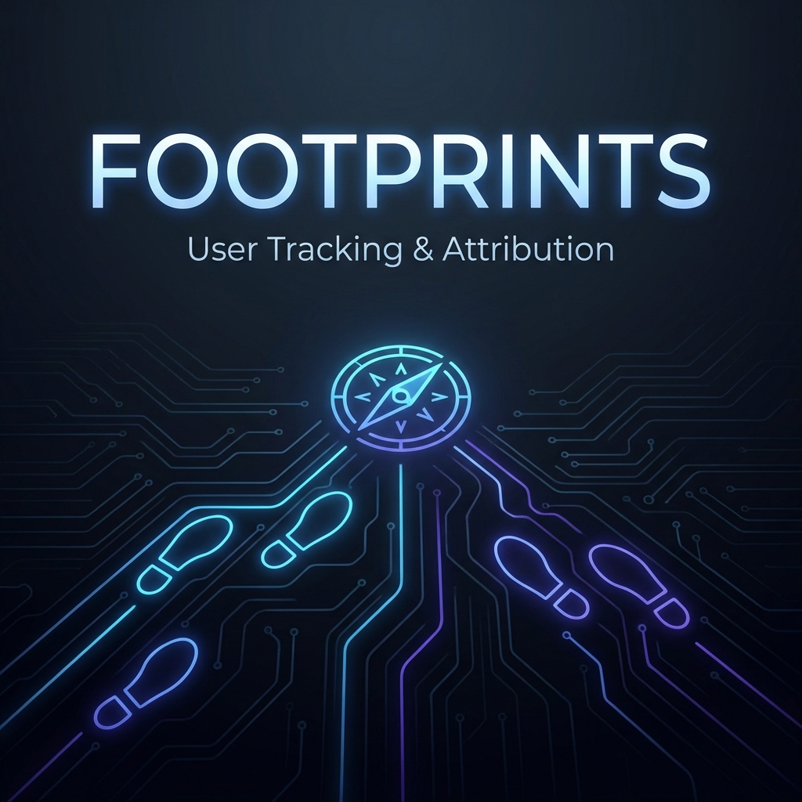

# :feet: Footprints



<p align="center">
    <a href="https://packagist.org/packages/ermradulsharma/footprints"></a>
    <a href="LICENSE.md"></a>
    <a href="https://github.com/ermradulsharma/footprints/actions"></a>
    <a href="https://packagist.org/packages/ermradulsharma/footprints"></a>
</p>

**Footprints** is a powerful yet simple registration attribution tracking solution for Laravel (7.0 to 12.0+). It helps you identify where your user signups originate from by tracking UTM parameters and HTTP referrers.

> “I know I waste half of my advertising dollars... I just wish I knew which half.” — _Henry Procter_

---

## :rocket: Why Footprints?

In modern marketing, knowing your **Return on Investment (ROI)** is everything. Footprints bridges the gap between a user's first visit and their eventual registration.

- **First-Touch Attribution**: Automatically tracks the journey of unauthenticated users.
- **Queueable Tracking**: High-performance tracking that doesn't slow down your application.
- **Bot Detection**: (Optional) Filter out search engine crawlers to keep your data clean.
- **Laravel 12 Ready**: Fully modernized with native PHP 8.2 features and constructor promotion.

---

## :package: Installation

Install the package via Composer:

```bash
composer require ermradulsharma/footprints
```

### 1. Setup

**Publish the configuration and migrations:**

```bash
php artisan vendor:publish --provider="Ermradulsharma\Footprints\FootprintsServiceProvider"
```

**Run the migrations:**

```bash
php artisan migrate
```

---

## :gear: Configuration

Add the `CaptureAttributionDataMiddleware` to your middleware stack.

### Laravel 11 & 12 (Modern)

In your `bootstrap/app.php`:

```php
->withMiddleware(function (Middleware $middleware) {
    $middleware->append(\Ermradulsharma\Footprints\Middleware\CaptureAttributionDataMiddleware::class);
})
```

### Laravel 10 and below (Legacy)

In `app/Http/Kernel.php`, add it after `EncryptCookies`:

```php
protected $middleware = [
    // ...
    \App\Http\Middleware\EncryptCookies::class,
    \Ermradulsharma\Footprints\Middleware\CaptureAttributionDataMiddleware::class,
];
```

---

## :user: Preparing your Model

Implement the `TrackableInterface` and use the `TrackRegistrationAttribution` trait in your user model (or any model you want to track registrations for).

```php
namespace App\Models;

use Ermradulsharma\Footprints\TrackableInterface;
use Ermradulsharma\Footprints\TrackRegistrationAttribution;
use Illuminate\Foundation\Auth\User as Authenticatable;

class User extends Authenticatable implements TrackableInterface
{
    use TrackRegistrationAttribution;

    // ...
}
```

---

## :bar_chart: Advanced Usage

### Retrieving Attribution Data

Once a user registers, Footprints automatically links their previous visits.

```php
$user = User::find(1);

// Get all visits before registration
$user->visits;

// Get initial attribution (The very first visit)
$user->initialAttributionData();

// Get final attribution (The visit right before signup)
$user->finalAttributionData();
```

### Masking IP Addresses

If you need to comply with GDPR or privacy regulations, you can disable IP tracking in `config/footprints.php`:

```php
'attribution_ip' => false,
```

### Custom Attribution Logic

You can implement your own logic for how users are "fingerprinted" by creating a class that implements `FootprinterInterface` and updating the `footprinter` key in the config.

---

## :shield: Features in Depth

### UTM Parameter Tracking

Footprints automatically captures:

- `utm_source`
- `utm_campaign`
- `utm_medium`
- `utm_term`
- `utm_content`

### Multi-Subdomain Support

If your app runs across multiple subdomains, you can track users seamlessly by setting your wildcard cookie domain:

```php
'cookie_domain' => '.yourdomain.com',
```

---

## :broom: Maintenance

### Pruning Data

To keep your `visits` table light, schedule the pruning command in `app/Console/Kernel.php`:

```php
$schedule->command('footprints:prune --days=30')->daily();
```

---

## :test_tube: Testing

```bash
composer test
```

## :handshake: Contributing

Contributions are welcome! If you find a bug or have a feature request, please open an issue or a pull request.

## :lock: License

The MIT License (MIT). Please see [License File](LICENSE.md) for more information.

---

<p align="center">
    Built with :heart: for the Laravel Community.
</p>
